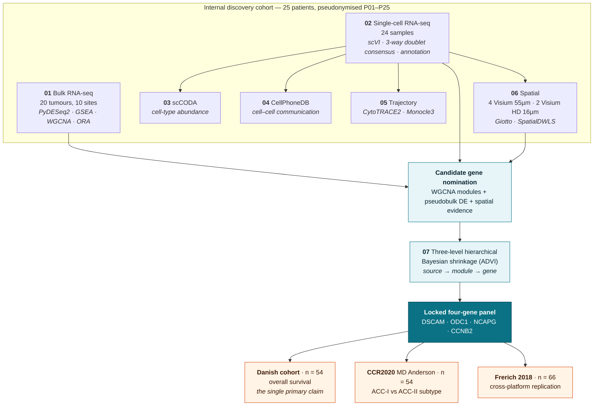

<div align="center">

# Head & Neck Adenoid Cystic Carcinoma — Multi-omic Analysis

**Bulk RNA-seq · single-cell RNA-seq · spatial transcriptomics · a locked four-gene prognostic panel**

[](LICENSE)
[](requirements.txt)
[](r_dependencies.txt)

</div>

---

## The study in one paragraph

Adenoid cystic carcinoma of the head and neck is indolent for years and then, in some patients,
is not. This repository holds the analysis code for a multi-omic comparison of tumours from
patients with **poor (< 2 years)** and **favourable (> 5 years)** survival, across bulk RNA-seq,
single-cell RNA-seq and spatial transcriptomics — and the derivation of a four-gene prognostic
panel validated in three independent external cohorts.

Every top-level folder corresponds to a numbered section of the paper's Supplementary Methods.

> ### The panel
>
> **`DSCAM` · `ODC1` · `NCAPG` · `CCNB2`** — scored as the unweighted mean of sign-weighted
> rank-inverse-normal expression, higher meaning worse prognosis.
>
> | | Danish cohort (n = 54) |
> |---|---|
> | 5-year overall survival, C-index | **0.671** (0.541–0.801) |
> | Hazard ratio per score SD | **1.74** (1.10–2.75), p = 0.017 |
> | Time-dependent AUC at 60 months | **0.688** (0.526–0.832) |
>
> Separately, the same score separates the MD Anderson ACC-I / ACC-II molecular subtypes at
> **AUC 0.884** (0.773–0.968), replicated in Frerich 2018.
>
> **No expression or outcome data from any external cohort contributed to gene selection or
> model fitting at any stage.** A three-level hierarchical Bayesian shrinkage procedure
> (source → module → gene, fitted by ADVI) chose the genes and their directions; it does not
> weight the deployed score, and no posterior quantity enters any reported C-index or hazard
> ratio.

---

## How the pieces fit together



---

## Repository map

| Folder | Supplementary Methods | Contents |
|---|---|---|
| [`01_bulk_rnaseq/`](01_bulk_rnaseq/) | Bulk RNA-seq 1–5 | PyDESeq2 differential expression, GSEA, WGCNA, over-representation analysis |
| [`02_single_cell/`](02_single_cell/) | Single cell 1–3 | QC, three-way doublet consensus, scVI integration, annotation, pseudobulk DE |
| [`03_sccoda/`](03_sccoda/) | Single cell 4 | scCODA compositional analysis of cell-type abundance |
| [`04_cellphonedb/`](04_cellphonedb/) | Single cell 5a–5d | CellPhoneDB cell–cell communication, patient-level and pooled analyses |
| [`05_trajectory/`](05_trajectory/) | Single cell 6 | CytoTRACE2 potency and Monocle3 trajectory inference |
| [`06_spatial/`](06_spatial/) | Single cell 7a–7e | Giotto pipelines for Visium (55 µm) and Visium HD (16 µm) |
| [`07_prognostic_model/`](07_prognostic_model/) | Section 8 | Hierarchical Bayesian shrinkage panel, external validation, frozen release |
| [`config/`](config/) | — | Data root definition and per-sample spatial parameters |

Each folder has its own README describing every script and the methods element it implements.
`figures/` subfolders contain the notebooks and R scripts that **generate** the manuscript
panels — no image files are distributed here.

---

## Cohorts

| Cohort | n | Role | Used for fitting? |
|---|---|---|---|
| Internal bulk RNA-seq | 20 tumours, 10 sites | Discovery; model fitting | ✅ yes |
| Internal single-cell RNA-seq | 24 samples (13 good, 11 poor) | Cell-type discovery, candidate nomination, deconvolution reference | ✅ yes |
| Internal spatial | 4 Visium (55 µm), 2 Visium HD (16 µm) | Spatial architecture | — |
| **Danish bulk RNA-seq** | 54 | Confirmatory external survival validation — the single primary claim | ❌ never entered any fit |
| **MD Anderson CCR2020** | 54 | Pre-specified external validation of molecular *subtype*, not survival | ❌ |
| **Frerich 2018** | 66 | Cross-platform replication of the subtype result (~18 patients shared with CCR2020, so **not** independent of it) | ❌ |

Full detail, including endpoints, event counts and survival-time availability, is in
[`07_prognostic_model/release/cohorts.csv`](07_prognostic_model/release/cohorts.csv).

---

## Getting started

The scripts read and write large data files (h5ad objects, Giotto objects, CellPhoneDB outputs)
that are **not** distributed with this code. Point `ACC_DATA_ROOT` at a local copy of the data
tree:

```bash
export ACC_DATA_ROOT=/path/to/acc_data
```

[`config/paths.py`](config/paths.py) and [`config/paths.R`](config/paths.R) are the single
definition of that root for Python and R. Scripts resolve sibling files relative to their own
location, so the repository can live anywhere.

> [!IMPORTANT]
> **Do not install everything into one environment.** The pipelines ran in several separate
> conda environments — scCODA and CellPhoneDB pin conflicting dependencies. Dependencies are
> listed in [`requirements.txt`](requirements.txt) (Python 3.11.15) and
> [`r_dependencies.txt`](r_dependencies.txt) (R 4.4.3);
> [`07_prognostic_model/release/environment.txt`](07_prognostic_model/release/environment.txt)
> records the exact environment behind every published model number.

### Where to start reading

| If you want… | Go to |
|---|---|
| The methods for one analysis | that section's `README.md` |
| The model itself | [`07_prognostic_model/release/model_spec.json`](07_prognostic_model/release/model_spec.json) — genes, signs, frozen reference, locked threshold |
| To score new samples | [`07_prognostic_model/release/score_acc4.py`](07_prognostic_model/release/score_acc4.py) — the one scoring function, cohort-batch and frozen single-sample |
| A specific number from the paper | [`07_prognostic_model/release/results_dictionary.csv`](07_prognostic_model/release/results_dictionary.csv) — every manuscript-facing value with its source file, generating script and evidence tier |
| To know what **not** to quote | [`07_prognostic_model/release/DEPRECATED.md`](07_prognostic_model/release/DEPRECATED.md) — superseded artefacts and the wrong numbers they would produce |

---

## Data availability

No expression data, clinical data or raw sequencing output is distributed in this repository.
It contains analysis code only.

Sample identifiers throughout are **pseudonyms** (`P01`–`P25`) and do not correspond to any
clinical, pathology or accession number. No per-patient metadata table is distributed here:
scripts that need outcome group, survival bracket or anatomical site read `clinical_info.csv`
from your own data tree at `$ACC_DATA_ROOT`.

> [!NOTE]
> Two sample-metadata columns were renamed from their original labels when this repository was
> prepared: `ModelOutcome1` and `ModelOutcome2`. If you are running these scripts against the
> original `.h5ad` or trait table, rename the corresponding columns to match.

---

## Reproducibility

The prognostic model ships as a frozen release rather than a re-runnable pipeline, because the
published numbers came from one specific environment against one specific set of inputs:

- [`release/MANIFEST.json`](07_prognostic_model/release/MANIFEST.json) — sha256 fingerprints of
  every raw and harmonised input, including the external cohorts
- [`release/environment.txt`](07_prognostic_model/release/environment.txt) and
  [`release/requirements-frozen.txt`](07_prognostic_model/release/requirements-frozen.txt) — the
  interpreter, GPU and package versions actually used
- [`release/results_dictionary.csv`](07_prognostic_model/release/results_dictionary.csv) — each
  number tagged `confirmatory`, `prespecified`, `secondary`, `exploratory`, `audit` or
  `withdrawn`, so post-hoc analyses are never mistaken for pre-specified ones

`release/build_release.py` verifies as it builds: `score_acc4.py` must reproduce the stored
Danish score and the reported frozen-reference C-index, or the build fails.

---

## Citation

If you use this code, please cite the associated manuscript.

## Licence

[MIT](LICENSE).
